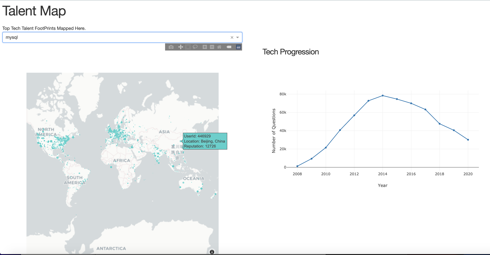

## Talent Map
Insight Data Engineering Fellowship Project San Francisco 2020C Session

<a href="https://docs.google.com/presentation/d/1UsXbqKeRogs3hbmVc5Wjg2klLq2HJ3mYCNAJhjxRNrQ/edit#slide=id.g96abc2b0f8_0_58">Slides</a> 
      <a href="https://youtu.be/aAGWPE6vkco">Demo</a> 

## Motivation 
Talent shortage is a real issue in the current market. Almost three quarters (72.8%) of employers are having a difficult time finding skilled candidates and More than 73% of job seekers today are only passively looking for a job. Remote work is becoming a new norm due to ongoing pandemic. It would be interesting to build a dashboard where companies can find the experienced resources across the globe for a particlar technology. Also how cool it would be to see how the technology is evolving over the years. 

## Pipeline 

## Architechture
### Spark
4 EC2 m5ad.2xlarge instances (1 master 3 slaves spark cluster)

<a href="https://blog.insightdatascience.com/simply-install-spark-cluster-mode-341843a52b88">Installation</a> 

### PostgreSQL
1 EC2 m5ad.xlarge instance

<a href="https://blog.insightdatascience.com/simply-install-postgresql-58c1e4ebf252">Installation</a>

### Dash
1 EC2 m5ad.large instance

<a href="https://dash.plotly.com/installation">Installation</a>

## DataSet
StackExchange data dump. <a href="https://archive.org/download/stackexchange">DataSet Link</a> 

## Metrics
For a given tag the dashboard displays:

1) Users having expertise in that particular tech across the globe . Their reputation and any url or contact information.

2) How the questions are evolving for a particular tag evolving over the years.

## DashBoard

